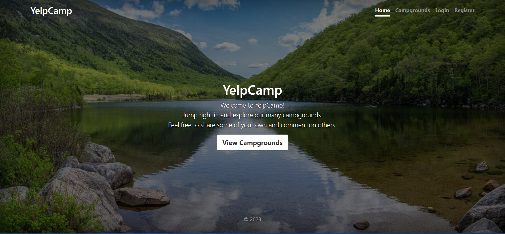

# YelpCamp

## Introduction:
YelpCamp is a web application built as part of Colt Steele's Udemy course "The Web Developer Bootcamp". 
YelpCamp allows users to create and view campgrounds, leave reviews, and more. This project was built using cutting-edge technologies such as Node.js, Express, and MongoDB.In this project, I implemented user authentication and authorization using Passport.js, allowing users to sign up, log in, and perform actions such as creating and editing campgrounds and reviews. I also used MongoDB to store data such as campgrounds, reviews, and user information.
I designed the front-end of the application using Bootstrap to create a responsive and visually appealing user interface. I also used EJS to dynamically render HTML pages based on data from the server. Overall, YelpCamp is a full-stack web application that showcases my skills in web development. From designing the front-end to implementing back-end functionality and working with databases, this project demonstrates my ability to build a complete web application from start to finish. I hope you enjoy exploring it!

##Try It Out!
# [Yelpcamp Page](https://yelpcampgrounds.onrender.com)

## Built with:
- JavaScript: Frontend & Backend
- HTML5/CSS3: Frontend
- Node.js: JavaScript runtime
- Express: Web application framework
- MongoDB: NoSQL database
- Mongoose: Object Data Modeling (ODM) library
- Passport.js: Authentication middleware
- Bootstrap: Front-end component library
- EJS: Embedded JavaScript templates

## Features:
- Modern looking and responsive landing page.
- Home page:
 - All users and guests can browse campgrounds.
 - responsive cluster map showing locations of the campgrounds around thew world.
- User authentication:
  - Users can Register new account, log in, and log out.
  - Only logged-in users can view reviews and leave reviews on campgrounds.
- Authorization: 
  - Only logged-in users can create and edit campgrounds and reviews. 
  - Users can only edit or delete their own campgrounds and reviews.
- Validation:
  - Client side validation using bootstrap forms validation.
  - Server side validation and validation using JOI.
- Campground management:
  - Users can create, edit, and delete campgrounds. 
  - Each campground includes a name, image, description, and price.
  - Each campground show page contains extra details about the campground and another map for the specific location of the campground.
- Review system: 
  - Users can leave reviews for campgrounds. 
  - Each review includes a rating and a comment.
- Responsive design: 
 -The website is designed to be responsive and works well on devices of all sizes.
 
## Installation:
- Clone the repo.
- Install all dependencies using `npm install`.
- create a .env file to add: (you will need mongo, cloudinary and mapbox working accounts)
  - Your cloudinary cloud name: `COLUDINARY_CLOUD_NAME`
  - Your cloudinary public key: `COLUDINARY_KEY`
  - Your cloudinary secret key: `COLUDINARY_SECRET`
  - Your MapBox key: `MAP_KEY`
  - Express session secret: `SESSION_SECRET`
  - Mongo db url: `DB_URL`
  - Mongo session store secret: `DB_STORE_SECRET`
  - Mongo localhost connection: `DB_URL_OLD` (only if you run mongo locally an dyou will need to change DB_URL to DB_URL_OLD in app.js file)
  - Youe admin id for seeding: `ADMIN_ID` ( create a new user and assign it as admin)
  - Run the server using `npm start`.
  - The server will run on port 3000 by default.
  - All the endpoints are available on `http://localhost:3000`
 
## Screenshots:
1. Landing Page:

2.Campgrounds Page 1:

3. Campgrounds Page 2:

4. Campgrounds Page 3:

5. Login Page:

6. Register Page:

7. Guest User Show Page:

8. Logged In User Show Page:

9. User added Campground Page:

10. New Campground Page:

11. Update Campground Page:

## 🤝 Support
Contributions, issues, and feature requests are welcome!
Give a ⭐️ if you like this project!

## Acknowledgements:
[Colt Steel's course](https://www.udemy.com/course/the-web-developer-bootcamp)
